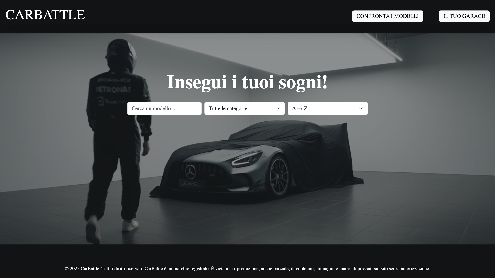
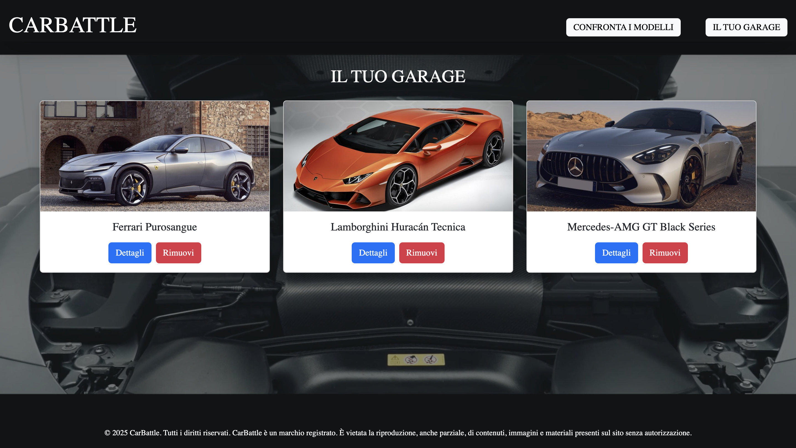

# CarBattle

### Descrizione del Progetto

Un'applicazione web elegante ed interattiva che permette agli utenti di esplorare, confrontare e collezionare auto di lusso sportive. Ogni veicolo è presentato con una scheda dettagliata contenente immagini, specifiche tecniche (come velocità massima, accelerazione, potenza, prezzo, motorizzazione) e confronti diretti tra modelli. Gli utenti possono selezionare le loro auto preferite e aggiungerle a un garage virtuale personalizzato per creare la propria collezione esclusiva.

### Tecnologie Utilizzate

HTML

CSS

JavaScript

React

Metodi avanzati di React

Fetch per chiamate API

Bootstrap

### Requisiti Tecnici
(RT1) Barra di ricerca con aggiornamento dinamico: Campo di input che consente agli utenti di cercare modelli di auto digitando il nome, i risultati si aggiornano in tempo reale mentre l'utente digita ed infine il filtro di ricerca è case-insensitive e supporta la ricerca parziale.

(RT2) Filtraggio per categoria: Le auto possono essere filtrate in base alla categoria inoltre il filtro è applicabile in combinazione con la ricerca e l’ordinamento.

(RT3) Ordinamento alfabetico: I risultati possono essere ordinati in ordine alfabetico dalla A alla Z o dalla Z alla A inoltre l’ordinamento si applica sull’elenco dei risultati filtrati/ricercati.

(RT4) Pagina di confronto: Una pagina dedicata al confronto tra due modelli di auto dove si mostrano fianco a fianco le specifiche tecniche, le immagini e le caratteristiche principali.

### Struttura del Progetto

La web app è composta da diverse pagine con funzionalità specifiche.

#### Homepage
Visualizzazione della ricerca dell'auto dei tuoi sogni attraverso input di ricerca, filtraggi e ordinamento alfabetico con possibilità di raggiungere la pagina di dettaglio dell'auto ricercata.

 - Barra di ricerca con aggiornamento dinamico;
 - Filtraggio per categoria;
 - Ordinamento alfabetico.

#### DetailsPage
Visualizzazione del dettaglio dell'auto ricercata con immagine in alta definizione e dei suoi dettagli tecnici, con possibilià di aggiunta o rimozione al garage.

#### ComparePage

Visualizzazione di un comparatore di max due auto, con le relative immagini ed i relativi dettagli tecnici, fianco a fianco così da migliorare l'esperienza utente.

#### Garage
Gli utenti possono visualizzare le loro auto preferite aggiunte ad un garage virtuale personalizzato per creare la propria collezione esclusiva. 

